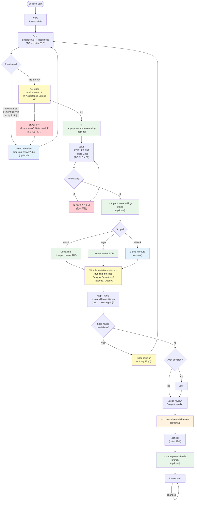
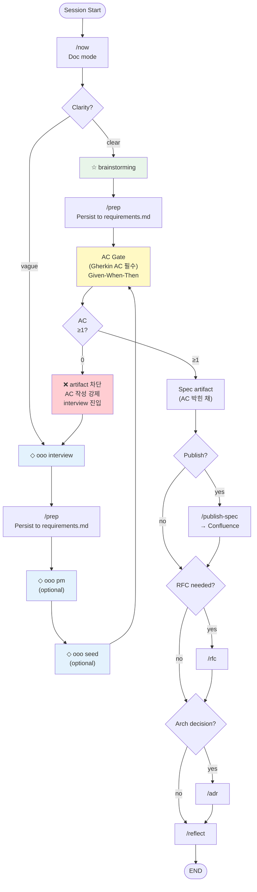

# nara-kit

> **Note:** Personal skill collection by shinnara. Workflows and conventions reflect personal preferences — use as reference or fork to adapt.
>
> 개인 워크플로우 스킬 모음. 개인 취향이 반영되어 있으므로 참고용 또는 포크해서 커스터마이즈.

Personal Claude Code workflow toolkit — 31 skills for structured software development and documentation workflows.

Claude Code 워크플로우 툴킷 — 구조화된 소프트웨어 개발 및 문서화를 위한 31개 스킬.

## Skills / 스킬 목록

### Workflow / 워크플로우

| Skill | Description / 설명 |
|-------|---------------------|
| `now` | Session state assessment + next action / 세션 상황 판단 + 다음 행동 추천 |
| `design-md` | Adopt, update, or audit a DESIGN.md — AI-readable design spec / AI용 디자인 스펙 생성·갱신·감사 |
| `workflow-orchestrator` | Route requests to dev or doc mode / 요청을 dev/doc 모드로 라우팅 |
| `workflow-dev-mode` | Implementation workflow (prep → gap → plan → execute → verify) / 구현 워크플로우 |
| `workflow-doc-mode` | Documentation workflow (spec/RFC/design artifacts) / 문서화 워크플로우 |
| `workflow-viz` | Generate self-contained HTML flow visualization from workflow.json / 워크플로우 시각화 HTML 생성 |

### Requirements & Analysis / 요구사항 & 분석

| Skill | Description / 설명 |
|-------|---------------------|
| `prep` | Localize external SoT (Jira/Figma/Confluence) into `docs/requirements.md` + Readiness score / 외부 SoT 로컬화 + 충분성 판정 |
| `gap` | Requirements vs implementation gap analysis → `docs/gap.md` (0-100 score) / 요구사항 vs 구현 갭 분석 |
| `incident` | Structured incident analysis report (no code changes) / 장애 분석 리포트 (코드 수정 없음) |
| `incident-fix` | TDD-based fix from `docs/incident-report.md` / 장애 리포트 기반 TDD 수정 |

### Code Lifecycle / 코드 라이프사이클

| Skill | Description / 설명 |
|-------|---------------------|
| `commit` | Generate conventional commit message with ticket ID / 커밋 메시지 생성 |
| `pr` | Generate PR title and body in Korean / PR 제목 + 본문 생성 |
| `code-review` | 5-agent parallel review (Architecture/Correctness/Reliability/Security/Test) / 5-에이전트 병렬 코드 리뷰 |
| `pr-respond` | Respond to PR review comments (accept/rebut/hold) / PR 리뷰 코멘트 대응 |
| `backlog` | Decompose features into subtasks, manage task status and blocked items / 태스크 분해, 상태·블록 관리 |
| `wt` | Create git worktree for a Jira ticket (`{repo}-{ticket}-{slug}`) — fetches summary, generates slug, asks for git type prefix / Jira 티켓 기반 worktree 생성 |

### Documentation / 문서

| Skill | Description / 설명 |
|-------|---------------------|
| `rfc` | Write RFC document in Korean Markdown / RFC 문서 작성 |
| `adr` | Architecture Decision Record / 아키텍처 결정 기록 |
| `explain` | Shareable explanations for different audiences / 대상별 설명 문서 생성 |
| `publish-spec` | Publish spec to Confluence wiki / 스펙 → Confluence 게시 |
| `wiki-inject` | Inject notes into personal LLM wiki (Obsidian) — routes by project (tech-notes / LINE) and type (source / meeting-summary / meeting-raw / concept-draft) / 프로젝트·타입별 위키 노트 주입 |
| `reflect` | Capture session learnings (decisions, conventions, warnings) / 세션 학습 캡처 |
| `humanizer` | Detect AI writing patterns in Korean text and rewrite as natural prose (KatFishNet 94.88% AUC, 40 patterns) / 한국어 AI 작문 패턴 감지 + 자연어 윤문 |

### Testing / 테스트

| Skill | Description / 설명 |
|-------|---------------------|
| `test-discover` | Discover test scenarios for a feature or file / 테스트 시나리오 발굴 |
| `test-verify` | Review and validate test scenarios (3-persona review) / 테스트 시나리오 검증 |
| `test-implement` | Implement tests from scenario documents / 시나리오 기반 테스트 구현 |

### Meta / 메타

| Skill | Description / 설명 |
|-------|---------------------|
| `empirical-prompt-tuning` | Iteratively improve prompts via bias-free executor testing — via [@mizchi](https://github.com/mizchi/skills/blob/main/empirical-prompt-tuning/SKILL.md) / 프롬프트 경험적 튜닝 |
| `skill-forge` | Improve and harden skills via Waza static analysis + EPT subagent execution / Waza+EPT 통합 스킬 개선 |
| `spec-revision` | Revise and version specs with review feedback, append to Confluence / 스펙 리비전 + Confluence 버전 관리 |
| `memory-audit` | Score auto-memory files 0-4 by 4 signals (age/ref_validity/code_drift/conflict) and flag hallucination-risk entries / 메모리 4신호 점수화로 환각 위험 탐지 |
| `memory-archive` | Move flagged memory to `archive/` and clean MEMORY.md index — reversible, never deletes / flag된 메모리 archive 폴더로 격리 (복구 가능, 자동 삭제 X) |

## Install / 설치

### 1. Marketplace 등록 / 마켓플레이스 추가

Claude Code 세션 안에서 slash command 실행:

```
/plugin marketplace add <repo-url>
```

`<repo-url>` 자리에 본 저장소의 git URL (또는 shorthand가 지원되는 호스트의 `<owner>/<repo>` 형식)을 넣음. 로컬 clone 경로 (`/path/to/nara-kit`)도 가능 — 개발용.

> 본 페이지를 어디서 읽고 있느냐에 따라 URL은 브라우저 주소창에 있음.

### 2. Plugin 설치 / 플러그인 설치

```
/plugin install nara-kit@nara-kit
```

> 표기 `<plugin-name>@<marketplace-name>`. 마켓플레이스 이름도 `nara-kit`이라 양쪽 동일.

### 3. Claude Code 재시작 / 재시작

Hooks는 SessionStart에만 로드됨. 설치 후 **반드시 재시작** 필요.

### 4. 검증 / 설치 확인

```
/plugin list
```

`nara-kit` 항목이 `Status: Enabled`, version 표시, 에러 0개면 정상.

캐시 위치 확인:

```bash
ls ~/.claude/plugins/cache/nara-kit/nara-kit/<version>/skills/
```

31개 스킬 디렉토리가 보이면 OK.

## Usage / 사용법

### 스킬 호출 / Invoke a skill

두 가지 방식:

**1) Slash command (명시 호출)** — 정확히 그 스킬만 실행:

```
/nara-kit:now
/nara-kit:prep PROJ-1234
/nara-kit:code-review
/nara-kit:rfc PROJ-5678
```

**2) 자연어 트리거 (라우팅)** — Claude가 `description`의 `USE FOR` 키워드로 자동 매칭:

```
"어디까지 했지"        → now
"요구사항 정리해줘"    → prep
"리뷰해줘"             → code-review
"PR 만들어"            → pr
"커밋 메시지"          → commit
```

각 스킬 `description`에 트리거 구문이 박혀있음. 모호하면 `workflow-orchestrator`가 dev/doc 모드로 라우팅.

### 워크플로우 진입 / Enter a workflow

전체 작업 흐름 (prep → gap → plan → execute → review):

```
"개발 모드로 시작"     → workflow-dev-mode
"기획 모드로 시작"     → workflow-doc-mode
"workflow"             → workflow-orchestrator (자동 분류)
```

상세 흐름은 아래 [Workflow](#workflow--워크플로우) 섹션의 mermaid 다이어그램 참조.

### 첫 사용 권장 순서 / First-time path

1. `/nara-kit:now` — 현재 세션 상태 점검
2. `/nara-kit:prep <TICKET>` — Jira·Confluence를 `docs/requirements.md`로 로컬화
3. `/nara-kit:gap` — 요구사항 vs 현재 코드 갭 점수
4. 구현 후 `/nara-kit:code-review` → `/nara-kit:pr`

## Update / 업데이트

```
/plugin marketplace update nara-kit
/plugin update nara-kit
```

업데이트 후 Claude Code 재시작 필수.

## Uninstall / 삭제

```
/plugin uninstall nara-kit
```

캐시까지 정리 (선택):

```bash
rm -rf ~/.claude/plugins/cache/nara-kit/
```

## Output Contract / 출력 규약

All nara-kit skills follow a shared output contract — responses are receipts (3-6 lines), not full artifacts. Status labels (`recorded only`, `applied`, `pending escalation`, `skipped`), MCP side effects, and escalation signals (`→ ESCALATE:`) are standardized. See [references/output-contract.md](references/output-contract.md).

모든 nara-kit 스킬은 공통 출력 규약을 따름 — 응답은 영수증(3-6라인)이며 산출물 자체가 아님. 상태 라벨, MCP 부수효과, 격상 신호가 표준화됨.

## Project Override Convention / 프로젝트 오버라이드 컨벤션

nara-kit skills are **general workflow engines**. Project-specific stack rules, conventions, and checks live in the project repo at `.claude/overrides/<skill-name>.md`. The skill loads the override at Step 0 and merges it with base behavior.

nara-kit 스킬은 **제너럴 워크플로우 엔진**. 프로젝트 특화 스택 룰·컨벤션·체크는 프로젝트 repo의 `.claude/overrides/<skill-name>.md` 에 둔다. 스킬이 Step 0에서 오버라이드를 로드하여 기본 동작에 병합.

### How it works / 동작 방식

1. Skill에 Step 0 override-load 게이트가 있는 경우, 실행 시작 시 cwd의 `.claude/overrides/<skill>.md` 확인
2. 존재 → 본문을 base prompt/checklist에 병합. 미존재 → silent skip
3. Override는 base check 비활성화 불가. **추가 / 격상 / 범위 축소만 가능**
4. Trailing status: `overrides: applied (path)` 또는 `overrides: none` 명시

### Example / 예시

iris-ui (Next.js + TanStack + LINE DS) repo:

```
iris-ui/
  .claude/
    overrides/
      code-review.md   # libs/fetch, TanStack v5, queryKey, Recoil, LINE DS checks
```

`/nara-kit:code-review` 실행 시 base 5-agent + iris-ui 특화 체크를 자동 병합.

### Skills with override support / 오버라이드 지원 스킬

| Skill | Override Path |
|-------|---------------|
| `code-review` | `.claude/overrides/code-review.md` |

(Add new skills as override gates are introduced. / 게이트 추가에 따라 목록 확장.)

## Workflow / 워크플로우

nara-kit skills are orchestrated in two modes. `workflow-orchestrator` classifies requests and routes to the appropriate mode. All 31 skills work standalone — external plugins enhance automation but are **not required**.

nara-kit 스킬은 두 모드로 오케스트레이션됨. `workflow-orchestrator`가 요청을 분류하여 적절한 모드로 라우팅. 31개 스킬 모두 독립 실행 가능 — 외부 플러그인은 자동화 수준을 높여주지만 **필수는 아님**.

### Mode A — Dev (Implementation / 구현)



> **ooo interview loop**: PARTIAL 또는 INSUFFICIENT readiness 시 `ooo interview`로 빠져 boundary 끌어내고 `prep`을 갱신. readiness 만족할 때까지 PREP↔OOO_INT 순환. 4/4 도달 시 AC Gate로 진입.
>
> **AC Gate (dev mode)**: `requirements.md`의 `## Acceptance Criteria` 섹션 비면 `gap` 진입 차단. doc-mode AC Gate와 동일 의미 — AC 없으면 P0 분류 정확도 ↓ + 후속 test-discover 1:1 매핑 불가. 외부 SoT 보강 또는 doc-mode로 handoff.

### Mode B — Doc (Documentation / 문서화)



### Legend / 범례

| Symbol | Plugin | Required? / 필수? |
|--------|--------|-------------------|
| (no symbol) | **nara-kit** (this plugin) | **Required** — core skills / 핵심 스킬 |
| ☆ green | **superpowers** | Optional — enhances planning, execution, review / 계획, 실행, 리뷰 강화 |
| ◇ blue | **ouroboros** | Optional — design discovery, execution fallback / 설계 발견, 실행 대안 |
| ☆ orange | **codex** | Optional — adversarial review / 반론 리뷰 |
| 🟡 yellow | **Gate / Artifact** | Workflow 강제 지점 / 산출 파일 |
| 🔴 red | **Block** | 게이트 미통과 시 차단 상태 |

### Stage-by-stage Skill Roles / 단계별 스킬 역할

워크플로우 다이어그램에 등장하는 nara-kit 스킬들의 *단계 컨텍스트* 설명. Skills 표는 카탈로그, 이 섹션은 *왜 그 단계에서 부르나*.

**Setup / 준비**
- `/now` — 세션 시작 또는 재개 시 git 브랜치/변경/문서/gap 점수/handoff 자동 점검 후 다음 행동 1-2개 추천. 질문 안 함.
- `/prep <TICKET>` — 외부 SoT (Jira / Confluence / Figma / Linear) → `docs/requirements.md` 로컬화. **AC verbatim 보존**. Readiness 4기준 평가.

**Analysis / 분석**
- `/gap` — `requirements.md` ↔ 코드 비교, **P0/P1/P2 자동 분류**, Verbatim pre-scan, Evidence 강제, `gap.md` 생성. Hard Gate signal 박음.
- `/gap --verify` — 기존 gap.md 경량 재검증 + **Notes Reconciliation**: `implementation-notes.md` Deviations ↔ Missing 매칭 → Agreed Exception 후보, Open Q [revise] → Spec Revise Candidates.

**Implementation / 구현 (run by `workflow-dev-mode`)**
- Execute 단계 → `docs/implementation-notes.md` 자동 생성 + 매 응답 `📝 notes:` trailing (drift running log).
- `/spec-revision` — Open Q [revise] 결정 후 Confluence v2 append + 외부 SoT 갱신 → `/prep` 재실행 트리거.

**Quality / 품질**
- `/code-review` — 5-agent 병렬 리뷰 (Architecture / Correctness / Reliability / Security / Test). PR 전 최종 점검.
- `/adr` — 아키텍처 결정 1건 ADR로 영속화. `implementation-notes.md`의 구조적 Deviation은 ADR 후보로 surface됨.

**Session End / 세션 마무리**
- `/reflect` — 세션 결정/컨벤션/주의사항 캡처. **`implementation-notes.md` 4섹션 자동 흡수**, auto-memory 저장, `docs/handoff.md` 작성 (Open Q 남으면).

**Docs Publishing / 문서 게시 (doc mode)**
- `/publish-spec` — 로컬 spec/plan markdown → Confluence wiki 게시 (dry-run → 확인 → 게시).
- `/rfc <TICKET>` — 기술 결정 RFC 한국어 마크다운 작성. 대안 비교 + 선택 이유.

**Post-merge / 머지 후**
- `/pr-respond` — PR 리뷰 코멘트 분류 (accept / rebut / hold) + 기술 검증 + 답변. 코드 변경 있으면 push 후 반복.

## Artifacts / 산출물

워크플로우 실행 중 생성되는 파일들:

| File | Generated by | Purpose / 역할 |
|------|--------------|----------------|
| `docs/requirements.md` | `prep` (외부 SoT 있을 때) <br>`workflow-doc-mode` (AC Gate 단계, AC 보강) | 외부 SoT 로컬화 + `## Acceptance Criteria` 섹션 (Gherkin 또는 bullet AC). 모든 후속 스킬(gap, test-discover, dev-mode)의 입력 SoT |
| `docs/sources/<id>.raw.md` | `prep` | 외부 SoT verbatim 원문 (의역·재구성 없음). AC 원본 보존 |
| `docs/gap.md` | `gap` | 요구사항 vs 구현 갭. **P0/P1/P2 분류 + Score + Hard Gate signal**. AC 본문 항목 자동 P0 |
| `docs/implementation-notes.md` | `workflow-dev-mode` (Execute) | 구현 중 running drift log. **4 카테고리**: Design decisions / Deviations / Tradeoffs / Open questions (`Type: confirm \| revise`) |
| `docs/handoff.md` | `reflect` | 다음 세션 인계 9-섹션 스키마. In Progress + Open Questions surface |
| `docs/test-scenarios/scenarios-detailed.md` | `test-discover` | AC ↔ 시나리오 1:1 매핑 포함 시나리오 목록 |
| `docs/incident-report.md` | `incident` | 장애 분석 — root cause 가설 + 증거 + 제안 수정 |
| `docs/plan/*.md` | doc-mode artifacts | spec / RFC / design / planning artifact (AC 박힌 채) |

### AC (Acceptance Criteria) 흐름 / Lifecycle

AC는 모든 스킬의 공유 SoT. 한 곳에 박혀 여러 곳에서 소비:

```
[원천 입력]
  ├─ 외부 SoT (Jira AC field, Confluence) ──┐
  └─ doc-mode brainstorm/interview ─────────┤
                                            ▼
                    docs/requirements.md
                    ## Acceptance Criteria
                    ┌──────────────────┐
                    │ AC1: Given...    │
                    │   When...        │
                    │   Then...        │
                    │ AC2: ...         │
                    └──────────────────┘
                            │
       ┌────────────────────┼────────────────────┐
       ▼                    ▼                    ▼
    gap                test-discover     workflow-dev-mode
    P0 자동 분류         시나리오 1:1 매핑    AC Gate 통과
       │                    │                    │
       ▼                    ▼                    ▼
    gap.md            scenarios.md       구현 (notes.md)
```

**핵심 원칙:**
- AC는 항상 `docs/requirements.md`의 `## Acceptance Criteria` 섹션에 박힘
- `prep`은 외부 SoT의 AC를 **verbatim 보존** — 추론·창작 금지
- 외부 SoT에 AC 없으면 `prep`은 빈 섹션 + `Open Questions: [blocking] AC 누락` 추가
- `workflow-doc-mode`의 AC Gate가 빈 AC 케이스를 잡아 작성 강제 (Gherkin 빈 템플릿 제시, 도메인 hint 금지)
- `gap`은 AC 본문 항목을 자동 P0 (Hard Gate)
- `test-discover`는 AC 1개당 시나리오 최소 1개 매핑 강제

## Gates / 게이트

워크플로우에 박힌 강제 지점. 통과 못하면 다음 단계 진입 차단.

| Gate | Where | Mechanism | 강도 |
|------|-------|-----------|------|
| **AC Gate** | `workflow-doc-mode` (artifact 생성 전) <br>`workflow-dev-mode` (gap 진입 전) | `requirements.md`의 `## Acceptance Criteria` 섹션 비면 차단. doc-mode는 spec 생성 차단, dev-mode는 gap 진입 차단. Gherkin (Given-When-Then) 빈 템플릿만 제시, 도메인 hint 금지. **prep이 외부 SoT의 AC를 verbatim 보존하므로 SoT에 AC 있으면 자동 통과.** SoT에 없으면 doc-mode로 handoff하여 사용자 확정 후 작성 | ★★★★ |
| **P0 Hard Gate** | `gap` | P0 Missing ≥ 1건이면 점수 무관 차단. 점수 ≥ 80 + P0 0건일 때만 review-ready | ★★★★ |
| **Implementation Notes Gate** | `workflow-dev-mode` (Execute) | Pre-flight로 `implementation-notes.md` 생성, 매 응답 `📝 notes:` trailing, verify는 빈 notes reject | ★★★ (state gate 부분 ★★★★) |
| **Notes Reconciliation** | `gap --verify` | `implementation-notes.md` Deviations ↔ gap Missing/Partial 매칭 → Agreed Exception 후보. `Open Q [revise]` → Spec Revise Candidates surface | ★★★ |
| **Pre-execution Gate** | `workflow-dev-mode` (plan → execute) | AskUserQuestion으로 plan 승인 받기 전 코드 변경 금지 | ★★★★ |
| **Readiness Gate** | `prep` | 4기준 (Functional / UNVERIFIED / blocking-Q / Goal) 충족 여부로 다음 단계 분기 | ★★★ |

### Gate 강도 정의 / Gate Strength

| 강도 | 메커니즘 |
|------|---------|
| ★★ | 텍스트 룰 (LLM 의지) |
| ★★★ | Trailing status / preflight 룰 |
| ★★★★ | State file / AskUserQuestion |
| ★★★★★ | Hook (shell 레벨 강제) |

## External Plugin Dependencies / 외부 플러그인 의존성

All external skills are **optional enhancements**. Without them, the workflow falls back to manual equivalents (e.g., write plans yourself, run tests directly).

모든 외부 스킬은 **선택적 강화**. 없으면 수동 대안으로 동작 (예: 직접 계획 작성, 직접 테스트 실행).

### Referenced by nara-kit skills / 스킬에서 직접 참조

| External Skill | Plugin | Referenced By | Stage / 단계 |
|----------------|--------|---------------|--------------|
| `superpowers:brainstorming` | superpowers | workflow-dev-mode | Design exploration / 설계 탐색 |
| `superpowers:subagent-driven-development` | superpowers | workflow-dev-mode | Large-scale execution / 대규모 실행 |
| `superpowers:receiving-code-review` | superpowers | pr-respond | Core principle (reference only) / 원칙 참조 |
| `ooo interview` | ouroboros | prep, workflow-dev-mode, workflow-doc-mode | Clarify requirements / 요구사항 명확화 |
| `ooo pm` | ouroboros | workflow-doc-mode | Product framing / 프로덕트 프레이밍 |
| `ooo seed` | ouroboros | workflow-doc-mode | Design snapshot / 설계 스냅샷 |
| `ooo run` / `ooo auto` | ouroboros | workflow-dev-mode | Execution fallback / 실행 대안 |
| `ooo evaluate` | ouroboros | workflow-dev-mode | Completion verification / 완료 검증 |

> **Note**: `ooo pm` and `ooo seed` also appear in `workflow-dev-mode/references/dev-workflow-details.md` routing table, but are only directly invoked from `workflow-doc-mode` SKILL.md. In dev mode, design discovery falls back to doc mode when requirements are unsettled.
>
> `ooo pm`, `ooo seed`는 dev-mode reference 라우팅 테이블에도 등장하지만, SKILL.md에서 직접 호출하는 건 doc-mode뿐. dev-mode에서 설계가 불명확하면 doc-mode로 handoff.
| `codex:adversarial-review` | codex | code-review | Adversarial final review / 반론 최종 리뷰 |

### Referenced by workflow rules only / workflow.md에서만 참조

These are invoked by CLAUDE.md workflow rules, not by nara-kit skills directly.

이 스킬들은 nara-kit 스킬이 아니라 CLAUDE.md 워크플로우 규칙에서 호출됨.

| External Skill | Plugin | Stage / 단계 |
|----------------|--------|--------------|
| `superpowers:writing-plans` | superpowers | Plan creation / 계획 생성 |
| `superpowers:test-driven-development` | superpowers | TDD gate / TDD 게이트 |
| `superpowers:finishing-a-development-branch` | superpowers | Branch finish / 브랜치 마무리 |

## My Setup / 내 설정

Other plugins I use alongside nara-kit / nara-kit과 함께 사용하는 플러그인:

| Plugin | Source | Purpose / 용도 |
|--------|--------|----------------|
| `superpowers` | `anthropics/claude-plugins-official` | Skill framework (brainstorming, SDD, worktrees, etc.) |
| `caveman` | `JuliusBrussee/caveman` | Terse response style / 간결한 응답 |
| `claude-mem` | `thedotmack/claude-mem` | Persistent memory across sessions / 세션 간 기억 |
| `claude-hud` | `jarrodwatts/claude-hud` | Token/session HUD overlay |
| `ouroboros` | `Q00/ouroboros` | Autonomous evolution engine / 자율 진화 엔진 |
| `plannotator` | `backnotprop/plannotator` | Plan annotation and analysis / 계획 주석 및 분석 |
| `codex` | `anthropics/claude-code-codex` | Codex integration (adversarial review, rescue) |

## Inspired By / 영감

| Source | What / 영향 |
|--------|-------------|
| [tiger-kit](https://github.com/MTGVim/tiger-kit) by @MTGVim | Core workflow loop (`now`, `prep`, `gap`, `reflect`), gap-driven development pattern / 핵심 워크플로우 루프, 갭 기반 개발 패턴 |
| [empirical-prompt-tuning](https://github.com/mizchi/skills/blob/main/empirical-prompt-tuning/SKILL.md) by @mizchi | EPT methodology (bias-free executor + two-sided evaluation) / EPT 방법론 |
| [superpowers](https://github.com/anthropics/claude-code-plugins-official) by Anthropic | Brainstorming, SDD, TDD, plan/finish patterns / 설계 탐색, 실행, 계획 패턴 |
| [ouroboros](https://github.com/Q00/ouroboros) by @Q00 | Interview → seed → evaluate flow / 인터뷰 → 시드 → 평가 흐름 |

## Configuration / 설정

For `publish-spec`: create `confluence.local.md` in plugin root:

`publish-spec` 사용 시: 플러그인 루트에 `confluence.local.md` 생성:

```yaml
---
confluence_base_url: https://your-confluence.example.com
default_space_key: YOUR_SPACE
default_parent_page_id: "YOUR_PAGE_ID"
default_parent_page_name: Development
---
```
