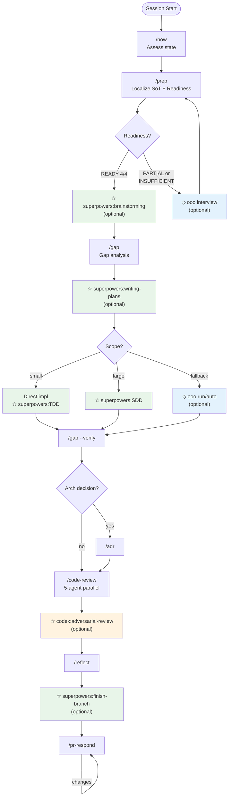
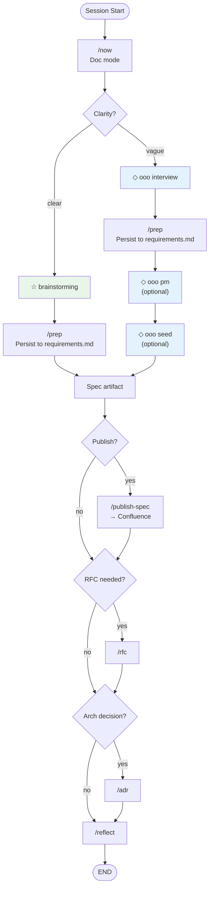

# nara-kit

> **Note:** Personal skill collection by [@shinnara](https://git.linecorp.com/shinnara). Workflows and conventions reflect personal preferences — use as reference or fork to adapt.
>
> 개인 워크플로우 스킬 모음. 개인 취향이 반영되어 있으므로 참고용 또는 포크해서 커스터마이즈.

Personal Claude Code workflow toolkit — 29 skills for structured software development and documentation workflows.

Claude Code 워크플로우 툴킷 — 구조화된 소프트웨어 개발 및 문서화를 위한 29개 스킬.

## Skills / 스킬 목록

### Workflow / 워크플로우

| Skill | Description / 설명 |
|-------|---------------------|
| `now` | Session state assessment + next action / 세션 상황 판단 + 다음 행동 추천 |
| `design-md` | Adopt, update, or audit a DESIGN.md — AI-readable design spec / AI용 디자인 스펙 생성·갱신·감사 |
| `workflow-orchestrator` | Route requests to dev or doc mode / 요청을 dev/doc 모드로 라우팅 |
| `workflow-dev-mode` | Implementation workflow (prep → gap → plan → execute → verify) / 구현 워크플로우 |
| `workflow-doc-mode` | Documentation workflow (spec/RFC/design artifacts) / 문서화 워크플로우 |
| `workflow-viz` | Generate self-contained HTML flow visualization from workflow.json / 워크플로우 시각화 HTML 생성 |

### Requirements & Analysis / 요구사항 & 분석

| Skill | Description / 설명 |
|-------|---------------------|
| `prep` | Localize external SoT (Jira/Figma/Confluence) into `docs/requirements.md` + Readiness score / 외부 SoT 로컬화 + 충분성 판정 |
| `gap` | Requirements vs implementation gap analysis → `docs/gap.md` (0-100 score) / 요구사항 vs 구현 갭 분석 |
| `incident` | Structured incident analysis report (no code changes) / 장애 분석 리포트 (코드 수정 없음) |
| `incident-fix` | TDD-based fix from `docs/incident-report.md` / 장애 리포트 기반 TDD 수정 |

### Code Lifecycle / 코드 라이프사이클

| Skill | Description / 설명 |
|-------|---------------------|
| `commit` | Generate conventional commit message with ticket ID / 커밋 메시지 생성 |
| `pr` | Generate PR title and body in Korean / PR 제목 + 본문 생성 |
| `code-review` | 5-agent parallel review (Architecture/Correctness/Reliability/Security/Test) / 5-에이전트 병렬 코드 리뷰 |
| `pr-respond` | Respond to PR review comments (accept/rebut/hold) / PR 리뷰 코멘트 대응 |
| `backlog` | Decompose features into subtasks, manage task status and blocked items / 태스크 분해, 상태·블록 관리 |

### Documentation / 문서

| Skill | Description / 설명 |
|-------|---------------------|
| `rfc` | Write RFC document in Korean Markdown / RFC 문서 작성 |
| `adr` | Architecture Decision Record / 아키텍처 결정 기록 |
| `explain` | Shareable explanations for different audiences / 대상별 설명 문서 생성 |
| `publish-spec` | Publish spec to Confluence wiki / 스펙 → Confluence 게시 |
| `wiki-inject` | Inject notes into personal LLM wiki (Obsidian) — routes by project (tech-notes / LINE) and type (source / meeting-summary / meeting-raw / concept-draft) / 프로젝트·타입별 위키 노트 주입 |
| `reflect` | Capture session learnings (decisions, conventions, warnings) / 세션 학습 캡처 |

### Testing / 테스트

| Skill | Description / 설명 |
|-------|---------------------|
| `test-discover` | Discover test scenarios for a feature or file / 테스트 시나리오 발굴 |
| `test-verify` | Review and validate test scenarios (3-persona review) / 테스트 시나리오 검증 |
| `test-implement` | Implement tests from scenario documents / 시나리오 기반 테스트 구현 |

### Meta / 메타

| Skill | Description / 설명 |
|-------|---------------------|
| `empirical-prompt-tuning` | Iteratively improve prompts via bias-free executor testing — via [@mizchi](https://github.com/mizchi/skills/blob/main/empirical-prompt-tuning/SKILL.md) / 프롬프트 경험적 튜닝 |
| `skill-forge` | Improve and harden skills via Waza static analysis + EPT subagent execution / Waza+EPT 통합 스킬 개선 |
| `spec-revision` | Revise and version specs with review feedback, append to Confluence / 스펙 리비전 + Confluence 버전 관리 |
| `memory-audit` | Score auto-memory files 0-4 by 4 signals (age/ref_validity/code_drift/conflict) and flag hallucination-risk entries / 메모리 4신호 점수화로 환각 위험 탐지 |
| `memory-archive` | Move flagged memory to `archive/` and clean MEMORY.md index — reversible, never deletes / flag된 메모리 archive 폴더로 격리 (복구 가능, 자동 삭제 X) |

## Install / 설치

```bash
claude plugin marketplace add https://git.linecorp.com/shinnara/nara-kit.git
```

## Output Contract / 출력 규약

All nara-kit skills follow a shared output contract — responses are receipts (3-6 lines), not full artifacts. Status labels (`recorded only`, `applied`, `pending escalation`, `skipped`), MCP side effects, and escalation signals (`→ ESCALATE:`) are standardized. See [references/output-contract.md](references/output-contract.md).

모든 nara-kit 스킬은 공통 출력 규약을 따름 — 응답은 영수증(3-6라인)이며 산출물 자체가 아님. 상태 라벨, MCP 부수효과, 격상 신호가 표준화됨.

## Project Override Convention / 프로젝트 오버라이드 컨벤션

nara-kit skills are **general workflow engines**. Project-specific stack rules, conventions, and checks live in the project repo at `.claude/overrides/<skill-name>.md`. The skill loads the override at Step 0 and merges it with base behavior.

nara-kit 스킬은 **제너럴 워크플로우 엔진**. 프로젝트 특화 스택 룰·컨벤션·체크는 프로젝트 repo의 `.claude/overrides/<skill-name>.md` 에 둔다. 스킬이 Step 0에서 오버라이드를 로드하여 기본 동작에 병합.

### How it works / 동작 방식

1. Skill에 Step 0 override-load 게이트가 있는 경우, 실행 시작 시 cwd의 `.claude/overrides/<skill>.md` 확인
2. 존재 → 본문을 base prompt/checklist에 병합. 미존재 → silent skip
3. Override는 base check 비활성화 불가. **추가 / 격상 / 범위 축소만 가능**
4. Trailing status: `overrides: applied (path)` 또는 `overrides: none` 명시

### Example / 예시

iris-ui (Next.js + TanStack + LINE DS) repo:

```
iris-ui/
  .claude/
    overrides/
      code-review.md   # libs/fetch, TanStack v5, queryKey, Recoil, LINE DS checks
```

`/nara-kit:code-review` 실행 시 base 5-agent + iris-ui 특화 체크를 자동 병합.

### Skills with override support / 오버라이드 지원 스킬

| Skill | Override Path |
|-------|---------------|
| `code-review` | `.claude/overrides/code-review.md` |

(Add new skills as override gates are introduced. / 게이트 추가에 따라 목록 확장.)

## Workflow / 워크플로우

nara-kit skills are orchestrated in two modes. `workflow-orchestrator` classifies requests and routes to the appropriate mode. All 29 skills work standalone — external plugins enhance automation but are **not required**.

nara-kit 스킬은 두 모드로 오케스트레이션됨. `workflow-orchestrator`가 요청을 분류하여 적절한 모드로 라우팅. 29개 스킬 모두 독립 실행 가능 — 외부 플러그인은 자동화 수준을 높여주지만 **필수는 아님**.

### Mode A — Dev (Implementation / 구현)



### Mode B — Doc (Documentation / 문서화)



### Legend / 범례

| Symbol | Plugin | Required? / 필수? |
|--------|--------|-------------------|
| (no symbol) | **nara-kit** (this plugin) | **Required** — core skills / 핵심 스킬 |
| ☆ green | **superpowers** | Optional — enhances planning, execution, review / 계획, 실행, 리뷰 강화 |
| ◇ blue | **ouroboros** | Optional — design discovery, execution fallback / 설계 발견, 실행 대안 |
| ☆ orange | **codex** | Optional — adversarial review / 반론 리뷰 |

## External Plugin Dependencies / 외부 플러그인 의존성

All external skills are **optional enhancements**. Without them, the workflow falls back to manual equivalents (e.g., write plans yourself, run tests directly).

모든 외부 스킬은 **선택적 강화**. 없으면 수동 대안으로 동작 (예: 직접 계획 작성, 직접 테스트 실행).

### Referenced by nara-kit skills / 스킬에서 직접 참조

| External Skill | Plugin | Referenced By | Stage / 단계 |
|----------------|--------|---------------|--------------|
| `superpowers:brainstorming` | superpowers | workflow-dev-mode | Design exploration / 설계 탐색 |
| `superpowers:subagent-driven-development` | superpowers | workflow-dev-mode | Large-scale execution / 대규모 실행 |
| `superpowers:receiving-code-review` | superpowers | pr-respond | Core principle (reference only) / 원칙 참조 |
| `ooo interview` | ouroboros | prep, workflow-dev-mode, workflow-doc-mode | Clarify requirements / 요구사항 명확화 |
| `ooo pm` | ouroboros | workflow-doc-mode | Product framing / 프로덕트 프레이밍 |
| `ooo seed` | ouroboros | workflow-doc-mode | Design snapshot / 설계 스냅샷 |
| `ooo run` / `ooo auto` | ouroboros | workflow-dev-mode | Execution fallback / 실행 대안 |
| `ooo evaluate` | ouroboros | workflow-dev-mode | Completion verification / 완료 검증 |

> **Note**: `ooo pm` and `ooo seed` also appear in `workflow-dev-mode/references/dev-workflow-details.md` routing table, but are only directly invoked from `workflow-doc-mode` SKILL.md. In dev mode, design discovery falls back to doc mode when requirements are unsettled.
>
> `ooo pm`, `ooo seed`는 dev-mode reference 라우팅 테이블에도 등장하지만, SKILL.md에서 직접 호출하는 건 doc-mode뿐. dev-mode에서 설계가 불명확하면 doc-mode로 handoff.
| `codex:adversarial-review` | codex | code-review | Adversarial final review / 반론 최종 리뷰 |

### Referenced by workflow rules only / workflow.md에서만 참조

These are invoked by CLAUDE.md workflow rules, not by nara-kit skills directly.

이 스킬들은 nara-kit 스킬이 아니라 CLAUDE.md 워크플로우 규칙에서 호출됨.

| External Skill | Plugin | Stage / 단계 |
|----------------|--------|--------------|
| `superpowers:writing-plans` | superpowers | Plan creation / 계획 생성 |
| `superpowers:test-driven-development` | superpowers | TDD gate / TDD 게이트 |
| `superpowers:finishing-a-development-branch` | superpowers | Branch finish / 브랜치 마무리 |

## My Setup / 내 설정

Other plugins I use alongside nara-kit / nara-kit과 함께 사용하는 플러그인:

| Plugin | Source | Purpose / 용도 |
|--------|--------|----------------|
| `superpowers` | `anthropics/claude-plugins-official` | Skill framework (brainstorming, SDD, worktrees, etc.) |
| `caveman` | `JuliusBrussee/caveman` | Terse response style / 간결한 응답 |
| `claude-mem` | `thedotmack/claude-mem` | Persistent memory across sessions / 세션 간 기억 |
| `claude-hud` | `jarrodwatts/claude-hud` | Token/session HUD overlay |
| `ouroboros` | `Q00/ouroboros` | Autonomous evolution engine / 자율 진화 엔진 |
| `plannotator` | `backnotprop/plannotator` | Plan annotation and analysis / 계획 주석 및 분석 |
| `codex` | `anthropics/claude-code-codex` | Codex integration (adversarial review, rescue) |

## Inspired By / 영감

| Source | What / 영향 |
|--------|-------------|
| [tiger-kit](https://github.com/MTGVim/tiger-kit) by @MTGVim | Core workflow loop (`now`, `prep`, `gap`, `reflect`), gap-driven development pattern / 핵심 워크플로우 루프, 갭 기반 개발 패턴 |
| [empirical-prompt-tuning](https://github.com/mizchi/skills/blob/main/empirical-prompt-tuning/SKILL.md) by @mizchi | EPT methodology (bias-free executor + two-sided evaluation) / EPT 방법론 |
| [superpowers](https://github.com/anthropics/claude-code-plugins-official) by Anthropic | Brainstorming, SDD, TDD, plan/finish patterns / 설계 탐색, 실행, 계획 패턴 |
| [ouroboros](https://github.com/Q00/ouroboros) by @Q00 | Interview → seed → evaluate flow / 인터뷰 → 시드 → 평가 흐름 |

## Configuration / 설정

For `publish-spec`: create `confluence.local.md` in plugin root:

`publish-spec` 사용 시: 플러그인 루트에 `confluence.local.md` 생성:

```yaml
---
confluence_base_url: https://your-confluence.example.com
default_space_key: YOUR_SPACE
default_parent_page_id: "YOUR_PAGE_ID"
default_parent_page_name: Development
---
```
