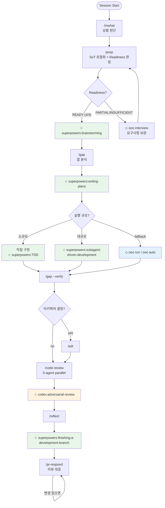
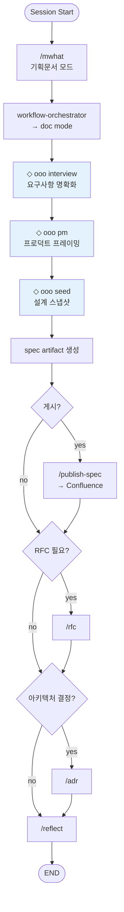
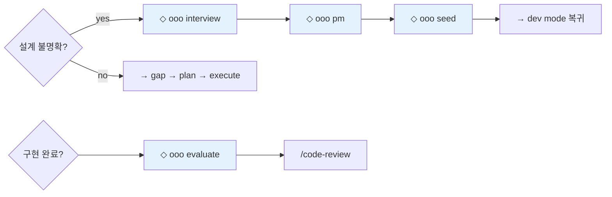

# nara-kit

> **Note:** Personal skill collection by [@shinnara](https://git.linecorp.com/shinnara). Workflows and conventions reflect personal preferences — use as reference or fork to adapt.

Personal Claude Code workflow toolkit.

## Skills

| Skill | Description |
|-------|-------------|
| `mwhat` | Session situation assessment + next action recommendation |
| `prep` | Localize external SoT (Jira/Figma/Confluence/PRD) into `docs/requirements.md` |
| `gap` | Requirements vs implementation gap analysis → `docs/gap.md` |
| `reflect` | Capture session learnings (decisions, conventions, warnings) |
| `rfc` | Write RFC document in Korean Markdown |
| `commit` | Generate conventional commit message |
| `pr` | Generate PR title and body |
| `incident` | Structured incident analysis report (analysis only, no code changes) |
| `incident-fix` | TDD-based fix implementation from `docs/incident-report.md` |
| `adr` | Architecture Decision Record |
| `code-review` | 5-agent parallel code review (Architecture/Correctness/Reliability/Security/Test) |
| `pr-respond` | PR review response workflow |
| `explain` | Generate shareable explanations for different audiences |
| `empirical-prompt-tuning` | Empirically evaluate and tune prompts/skills with test cases — via [@mizchi](https://github.com/mizchi/skills/blob/main/empirical-prompt-tuning/SKILL.md) |
| `workflow-orchestrator` | End-to-end workflow routing (doc or dev mode) |
| `workflow-dev-mode` | Development workflow (requirements → gap → plan → execute → verify) |
| `workflow-doc-mode` | Documentation workflow (spec/RFC/design artifacts) |
| `test-discover` | Generate test scenarios for a feature or file |
| `test-verify` | Review and validate test scenarios |
| `test-implement` | Implement tests from scenario documents |
| `publish-spec` | Publish spec/plan to Confluence wiki |

## Install

```bash
claude plugin marketplace add https://git.linecorp.com/shinnara/nara-kit.git
```

## Workflow

nara-kit skills are orchestrated in two modes. `workflow-orchestrator` classifies incoming requests and routes to the appropriate mode.

### Mode A — Dev (Implementation)



### Mode B — Doc (Documentation)



### Design Discovery (workflow-dev-mode 내부)

dev mode에서 요구사항이 불명확할 때 ouroboros skills로 fallback:



### Legend

| Symbol | Plugin | Used at |
|--------|--------|---------|
| ☆ | **superpowers** | brainstorming, writing-plans, TDD, SDD execution, finishing branch |
| ◇ | **ouroboros** | interview, pm, seed (design discovery), run/auto (execution fallback), evaluate (completion) |
| ☆ | **codex** | adversarial-review (final review) |

## External Plugin Dependencies

nara-kit skills reference external plugin skills at specific workflow stages:

| External Skill | Plugin | Used By | Stage |
|----------------|--------|---------|-------|
| `superpowers:brainstorming` | superpowers | workflow-dev-mode | Step 2 — Design exploration |
| `superpowers:writing-plans` | superpowers | workflow-dev-mode | Step 4 — Plan creation |
| `superpowers:subagent-driven-development` | superpowers | workflow-dev-mode | Step 5 — Large-scale execution |
| `superpowers:test-driven-development` | superpowers | workflow-dev-mode | Step 5 — TDD gate |
| `superpowers:finishing-a-development-branch` | superpowers | workflow-dev-mode | Step 10 — Branch finish |
| `superpowers:receiving-code-review` | superpowers | pr-respond | Core principle |
| `superpowers:using-git-worktrees` | superpowers | workflow-dev-mode | Workspace isolation |
| `ooo interview` | ouroboros | workflow-dev-mode, workflow-doc-mode | Discovery — clarify requirements |
| `ooo pm` | ouroboros | workflow-dev-mode, workflow-doc-mode | Discovery — product framing |
| `ooo seed` | ouroboros | workflow-dev-mode, workflow-doc-mode | Discovery — design snapshot |
| `ooo run` / `ooo auto` | ouroboros | workflow-dev-mode | Step 5 — Execution fallback |
| `ooo evaluate` | ouroboros | workflow-dev-mode | Step 8 — Completion verification |
| `codex:adversarial-review` | codex | workflow-dev-mode | Step 8 — Adversarial final review |

## My Setup

Other plugins I use alongside nara-kit:

| Plugin | Source | Purpose |
|--------|--------|---------|
| `superpowers` | `anthropics/claude-plugins-official` | Skill framework (brainstorming, SDD, worktrees, etc.) |
| `caveman` | `JuliusBrussee/caveman` | Terse response style |
| `claude-mem` | `thedotmack/claude-mem` | Persistent memory across sessions |
| `claude-hud` | `jarrodwatts/claude-hud` | Token/session HUD overlay |
| `ouroboros` | `Q00/ouroboros` | Autonomous evolution engine |
| `plannotator` | `backnotprop/plannotator` | Plan annotation and analysis |
| `harness` | `revfactory/harness` | Multi-agent orchestration |
| `context-mode` | `context-mode` | Context window management |

## Configuration

For `publish-spec`: create `confluence.local.md` in plugin root:

```yaml
---
confluence_base_url: https://your-confluence.example.com
default_space_key: YOUR_SPACE
default_parent_page_id: "YOUR_PAGE_ID"
default_parent_page_name: Development
---
```
