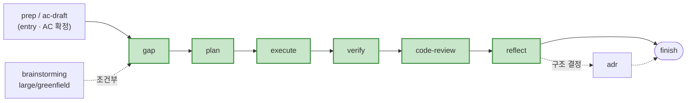
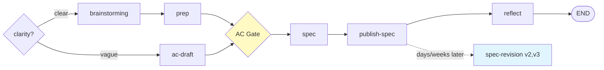

# nara-kit skills

**38 skills**, grouped below. Invoke explicitly (`/nara-kit:<skill>`) or via natural-language trigger (each skill's `USE FOR` keywords). 모호하면 `workflow-orchestrator`가 dev/doc 모드로 라우팅.

← Back to [root README](../README.md).

## Catalog / 카탈로그

### Workflow / 워크플로우

| Skill | Description / 설명 |
|-------|---------------------|
| `now` | Session state assessment + next action / 세션 상황 판단 + 다음 행동 추천 |
| `design-md` | Adopt, update, or audit a DESIGN.md — AI-readable design spec / AI용 디자인 스펙 생성·갱신·감사 |
| `workflow-orchestrator` | Route requests to dev or doc mode / 요청을 dev/doc 모드로 라우팅 |
| `workflow-dev-mode` | Implementation workflow (core spine: gap → plan → execute → verify → code-review → reflect) / 구현 워크플로우 |
| `workflow-doc-mode` | Documentation workflow (spec/RFC/design artifacts) / 문서화 워크플로우 |
| `workflow-viz` | Generate self-contained HTML flow visualization from workflow.json / 워크플로우 시각화 HTML 생성 |

### Requirements & Analysis / 요구사항 & 분석

| Skill | Description / 설명 |
|-------|---------------------|
| `prep` | Localize external SoT (Jira/Figma/Confluence) into `docs/requirements.md` + Readiness score / 외부 SoT 로컬화 + 충분성 판정 |
| `ac-draft` | Generate User Stories + Gherkin AC from one-line intent (no external SoT). Sister of `prep` / 한 줄 의도 → US + Gherkin AC 생성 (외부 SoT 없을 때) |
| `gap` | Requirements vs implementation gap analysis → `docs/gap.md` (0-100 score) / 요구사항 vs 구현 갭 분석 |
| `incident` | Structured incident analysis report (no code changes) / 장애 분석 리포트 (코드 수정 없음) |
| `incident-fix` | TDD-based fix from `docs/incident-report.md` / 장애 리포트 기반 TDD 수정 |
| `slack-to-jira` | Turn Slack thread permalinks into Jira tickets (classify Bug/Feature, dedup, draft → approve → create, English content) / 슬랙 스레드 → Jira 티켓 |

### Code Lifecycle / 코드 라이프사이클

| Skill | Description / 설명 |
|-------|---------------------|
| `commit` | Generate conventional commit message with ticket ID / 커밋 메시지 생성 |
| `pr` | Generate PR title and body in Korean / PR 제목 + 본문 생성 |
| `code-review` | 5-agent parallel review (Architecture/Correctness/Reliability/Security/Test) / 5-에이전트 병렬 코드 리뷰 |
| `pr-respond` | Respond to PR review comments (accept/rebut/hold) / PR 리뷰 코멘트 대응 |
| `review-reminder` | Find PRs where you are a requested reviewer but haven't reviewed yet → create Multica reminder issues / 미리뷰 PR 탐지 |
| `review-queue` | Drain Multica "리뷰 필요" reminder issues → trigger built-in `/review` per PR, write verdict back as issue comment (read-only). Consumer pair of `review-reminder` / 멀티카 리뷰 큐 드레인 |
| `wt` | Create git worktree for a Jira ticket (`{repo}-{ticket}-{slug}`) — fetches summary, generates slug, asks for git type prefix / Jira 티켓 기반 worktree 생성 |

### Documentation / 문서

| Skill | Description / 설명 |
|-------|---------------------|
| `rfc` | Write RFC document in Korean Markdown / RFC 문서 작성 |
| `adr` | Architecture Decision Record / 아키텍처 결정 기록 |
| `explain` | Shareable explanations for different audiences / 대상별 설명 문서 생성 |
| `publish-spec` | Publish spec to Confluence wiki / 스펙 → Confluence 게시 |
| `reflect` | Capture session learnings (decisions, conventions, warnings) / 세션 학습 캡처 |
| `humanizer` | Detect AI writing patterns in Korean text and rewrite as natural prose (KatFishNet 94.88% AUC, 41 patterns) / 한국어 AI 작문 패턴 감지 + 윤문 |

### Testing / 테스트

| Skill | Description / 설명 |
|-------|---------------------|
| `test-discover` | Discover test scenarios for a feature or file / 테스트 시나리오 발굴 |
| `test-verify` | Review and validate test scenarios (3-persona review) / 테스트 시나리오 검증 |
| `test-implement` | Implement tests from scenario documents / 시나리오 기반 테스트 구현 |
| `golden-path-discover` | Discover live golden-path E2E scenarios + Playwright-ready export / 라이브 골든패스 E2E 발굴 + Playwright export |

### Automation / 자동화

| Skill | Description / 설명 |
|-------|---------------------|
| `trending-digest` | Crawl GitHub Trending weekly, LLM-filter for AI/LLM + DX tools, post digest to Slack DM + Obsidian / GitHub 트렌딩 주간 크롤 → 필터링 → Slack DM + Obsidian |
| `jira-triage` | Poll Jira for tickets assigned to you, classify 구현/버그픽스/기획/기타, emit a Multica issue with a ready-to-run launch kit (never executes code) / 내 Jira 티켓 폴링 → 분류 → 런치킷 Multica 이슈 발급 |
| `jira-drain` | Launch a chosen jira-triage queue ticket into an aoe session (group + worktree), drive dev-mode/doc-mode to a PR — interactive ($0), human-triggered / 큐 티켓 1건 → aoe 세션 착수 → PR까지 자율 (인터랙티브 $0) |

### Meta / 메타

| Skill | Description / 설명 |
|-------|---------------------|
| `empirical-prompt-tuning` | Iteratively improve prompts via bias-free executor testing — via [@mizchi](https://github.com/mizchi/skills/blob/main/empirical-prompt-tuning/SKILL.md) / 프롬프트 경험적 튜닝 |
| `skill-forge` | Improve and harden skills via Waza static analysis + EPT subagent execution / Waza+EPT 통합 스킬 개선 |
| `meta-feedback` | Capture friction with nara-kit's own skills → generalized, privacy-redacted improvement proposal (feeds `skill-forge`) / nara-kit 스킬 friction → 개선안 |
| `spec-revision` | Revise and version specs with review feedback, append to Confluence / 스펙 리비전 + Confluence 버전 관리 |
| `memory-audit` | Score auto-memory files 0-4 by 4 signals (age/ref_validity/code_drift/conflict) and flag hallucination-risk entries / 메모리 4신호 점수화로 환각 위험 탐지 |
| `memory-archive` | Move flagged memory to `archive/` and clean MEMORY.md index — reversible, never deletes / flag된 메모리 archive 격리 (복구 가능) |

## Usage / 사용법

**Slash command (명시 호출)** — 정확히 그 스킬만: `/nara-kit:now`, `/nara-kit:prep PROJ-1234`, `/nara-kit:code-review`.

**자연어 트리거 (라우팅)** — Claude가 `description`의 `USE FOR` 키워드로 자동 매칭: `"어디까지 했지"` → now, `"요구사항 정리해줘"` → prep, `"리뷰해줘"` → code-review.

**워크플로우 진입**: `"개발 모드로 시작"` → dev-mode / `"기획 모드로 시작"` → doc-mode / `"workflow"` → orchestrator (자동 분류).

**첫 사용 권장 순서**: `now` (상태 점검) → `prep <TICKET>` (요구사항 로컬화) → `gap` (갭 점수) → 구현 → `code-review` → `pr`.

## Workflow / 워크플로우

`workflow-orchestrator`가 요청을 dev/doc 모드로 분류·라우팅. 38개 스킬 모두 독립 실행 가능 — 외부 플러그인은 자동화를 강화하지만 **필수는 아님** (없으면 수동 대안).

### Mode A — Dev (Implementation / 구현)

**Core spine (mandatory, 6단계 — 매 단계가 인간 검증 재료를 산출):** `gap → plan → execute → verify → code-review → reflect`

- **Entry (조건부)**: 외부 SoT 있으면 `prep`, 한 줄 의도면 `ac-draft`. AC Gate 통과 후 spine 진입.
- **조건부 satellites**: `brainstorming`(large/greenfield), `adr`(구조 결정 시), impl-notes(medium/large). `small`/bugfix는 전부 skip하고 코어 6단계 직행.
- **plan 승인**은 plan 단계에 흡수 (별도 pre-execution phase 없음). 완료 전 AI 점수 판정 단계는 제거됨 (AI-as-judge 안티패턴 — `verify` + `code-review`가 검증 담당).

### Mode B — Doc (Documentation / 문서화)

- **Revision loop**: `publish-spec` 이후 피드백 수집되면 별개 세션에서 `/spec-revision <URL>` — 라운드마다 버전 append (워크플로 재진입 아닌 standalone).
- `adr`(구조 결정), `rfc`(기술 결정)는 필요 시 spec 산출 후 호출.

**Legend**: (no symbol) **nara-kit** required · ☆ **superpowers** optional · 🟢 green border **core spine** · 🟡/🔴 **gate / block**.

## Gates / 게이트

워크플로우 강제 지점. 통과 못하면 다음 단계 진입 차단.

| Gate | Where | Mechanism | 강도 |
|------|-------|-----------|------|
| **AC Gate** | doc-mode (artifact 전) / dev-mode (gap 전) | `## Acceptance Criteria` 비면 차단. Gherkin 빈 템플릿만 제시. SoT에 AC 있으면 자동 통과 | ★★★★ |
| **P0 Hard Gate** | `gap` | P0 Missing ≥ 1이면 점수 무관 차단. 점수 ≥ 80 + P0 0건만 review-ready | ★★★★ |
| **Plan Approval** (folded) | dev-mode (plan 단계 내) | plan에 흡수된 AskUserQuestion 승인 전 코드 변경 금지. 별도 phase 아님 | ★★★★ |
| **Implementation Notes Gate** (scope-scaled) | dev-mode (Execute, medium/large) | medium/large만: impl-notes 생성 + `📝 notes:` trailing + verify 빈 notes reject. `small` skip | ★★★ |
| **Notes Reconciliation** | `gap --verify` | impl-notes Deviations ↔ gap Missing 매칭 → Agreed Exception 후보. Open Q [revise] → Spec Revise Candidates | ★★★ |
| **Readiness Gate** | `prep` | 4기준 (Functional / UNVERIFIED / blocking-Q / Goal) 충족으로 다음 단계 분기 | ★★★ |

강도: ★★ 텍스트 룰 · ★★★ trailing/preflight · ★★★★ state file/AskUserQuestion · ★★★★★ hook (shell 강제).

## Artifacts / 산출물

워크플로우가 `docs/`에 생성하는 파일들 (gitignore — per-project 작업물).

| File | Generated by | Purpose |
|------|--------------|---------|
| `docs/requirements.md` | `prep` / `ac-draft` | 외부 SoT 로컬화 + `## Acceptance Criteria`. 모든 후속 스킬의 입력 SoT |
| `docs/sources/<id>.raw.md` | `prep` | 외부 SoT verbatim 원문 (AC 원본 보존) |
| `docs/gap.md` | `gap` | 요구 vs 구현 갭. P0/P1/P2 + Score + Hard Gate. AC 본문 = 자동 P0 |
| `docs/implementation-notes.md` | dev-mode (Execute, medium/large) | 구현 중 drift log. 4 카테고리: Design / Deviations / Tradeoffs / Open Q. `small`은 skip |
| `docs/handoff.md` | `reflect` | 다음 세션 인계 8-섹션. In Progress + Open Questions surface |
| `docs/test-scenarios/*.md` | `test-discover` / `golden-path-discover` | AC↔시나리오 1:1 매핑, Playwright-ready E2E export |
| `docs/incident-report.md` | `incident` | root cause 가설 + 증거 + 제안 수정 |
| `docs/plan/*.md` | doc-mode | spec / RFC / design artifact (AC 박힌 채) |

**AC lifecycle**: AC는 모든 스킬의 공유 SoT. `prep`이 외부 SoT의 AC를 **verbatim 보존** → `docs/requirements.md`의 `## Acceptance Criteria`에 박힘 → `gap`(P0 자동분류) / `test-discover`(시나리오 1:1) / dev-mode(AC Gate) 가 소비. SoT에 AC 없으면 doc-mode AC Gate가 작성 강제.

## Output Contract / 출력 규약

모든 스킬은 공통 출력 규약을 따름 — 응답은 **영수증(3-6라인)**이며 산출물 자체가 아님. 상태 라벨 (`recorded only` / `applied` / `pending escalation` / `skipped`), MCP 부수효과, 격상 신호 (`→ ESCALATE:`)가 표준화됨. See [../references/output-contract.md](../references/output-contract.md).

## Project Override Convention / 프로젝트 오버라이드

nara-kit 스킬은 **제너럴 워크플로우 엔진**. 프로젝트 특화 룰은 소비 repo의 `.claude/overrides/<skill>.md`에 둠. 스킬이 Step 0에서 로드하여 base에 병합 (존재 시). Override는 base check 비활성화 불가 — **추가 / 격상 / 범위 축소만**. Trailing status에 `overrides: applied (path)` 또는 `none` 명시. 지원: `code-review`.

## External Plugin Dependencies / 외부 의존성

모든 외부 스킬은 **선택적 강화** — 없으면 수동 대안으로 동작.

| External Skill | Plugin | Referenced By | Stage |
|----------------|--------|---------------|-------|
| `superpowers:brainstorming` | superpowers | dev-mode / doc-mode | Design exploration (조건부) |
| `superpowers:writing-plans` | superpowers | dev-mode (plan) | Plan creation |
| `superpowers:subagent-driven-development` | superpowers | dev-mode | Large-scale execution |
| `superpowers:finishing-a-development-branch` | superpowers | dev-mode | Branch finish |
| `superpowers:receiving-code-review` | superpowers | pr-respond | Core principle (ref only) |
| `codex:adversarial-review` | codex | code-review | Adversarial final review |
