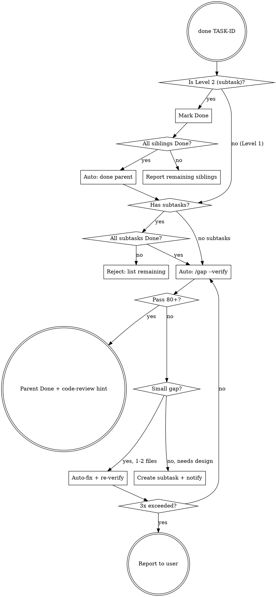

# done Flow

## Decision Tree



## Verify Loop Rules

- Max 3 iterations of auto-fix → re-verify
- Small gap: 1-2 files, clear fix, no design needed → auto-fix in same session
- Large gap: new feature, architecture change, blocked dependency → create new subtask
- After 3 failures: report remaining gaps to user with specifics

## Commands Used

```bash
# Mark task done
backlog task edit TASK-ID -s "Done"

# Check siblings
backlog task list -s "To Do"
backlog task list -s "In Progress"
```

## Output Format

### Subtask Done
```
TASK-{ID} 완료.
남은 서브태스크: TASK-{X}, TASK-{Y}
다음: TASK-{X} 착수 (새 세션 추천)
```

### Parent Done (after verify pass)
```
TASK-{ID} 검증 통과 (점수: {N}/100). Done 처리 완료.
다음: code-review → 마무리
```

### Verify Failed
```
TASK-{ID} 검증 미달 (점수: {N}/100).
미충족 항목:
- {gap item 1}
- {gap item 2}
{auto-fix 시도 | 서브태스크 생성됨}
```
