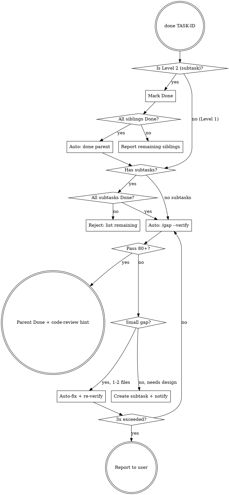

# done Flow

## Decision Tree



## Verify Loop Rules

- Max 3 iterations of auto-fix → re-verify
- Small gap: 1-2 files, clear fix, no design needed → auto-fix in same session
- Large gap: new feature, architecture change, blocked dependency → create new subtask
- After 3 failures: report remaining gaps to user with specifics

## Handoff Context Preservation (필수)

`/gap --verify` 실행 **직전**, 태스크 컨텍스트를 `docs/handoff.md` "## 9. 최근 완료 태스크 컨텍스트" 섹션에 append.

이유: gap --verify는 요구사항 단위로 분석하므로 태스크 title/AC/note에 담긴 미세 컨텍스트가 손실됨. 검증 실패 → 서브태스크 분기 시 그 컨텍스트가 다음 세션에 필요.

### Append 형식

```markdown
## 9. 최근 완료 태스크 컨텍스트

### TASK-{ID} — {title}
- Completed: {ISO8601}
- AC: {acceptance criteria 한 줄 요약 또는 verbatim 인용}
- Notes: {태스크 description/note 중 코드/커밋만 봐선 알 수 없는 흐름. 없으면 "없음"}
- Files touched: {git diff --name-only 결과 파일 경로 — 최대 5개}
- Gap verify trigger: pending | passed ({score}) | failed ({score})
```

### 규칙

- 섹션 미존재 시 9번 섹션으로 생성. 기존 항목 위에 최신 append (가장 위가 최근)
- 한 태스크당 한 블록. 같은 TASK-ID 재진입 시 기존 블록 덮어쓰기
- 최대 5개 유지. 초과 시 가장 오래된 항목 제거
- `handoff.md` 파일 자체 없으면 9섹션 스키마(reflect 정의) 골격을 만들고 9번 섹션부터 채움 (다른 섹션은 비어있음 처리). reflect 호출 시 다른 섹션 채워짐
- gap verify 결과 확정 후 같은 블록의 `Gap verify trigger` 갱신

## Commands Used

```bash
# Mark task done
backlog task edit TASK-ID -s "Done"

# Check siblings
backlog task list -s "To Do"
backlog task list -s "In Progress"
```

## Output Format

### Subtask Done
```
TASK-{ID} 완료.
남은 서브태스크: TASK-{X}, TASK-{Y}
다음: TASK-{X} 착수 (새 세션 추천)
```

### Parent Done (after verify pass)
```
TASK-{ID} 검증 통과 (점수: {N}/100). Done 처리 완료.
다음: code-review → 마무리
```

### Verify Failed
```
TASK-{ID} 검증 미달 (점수: {N}/100).
미충족 항목:
- {gap item 1}
- {gap item 2}
{auto-fix 시도 | 서브태스크 생성됨}
```
