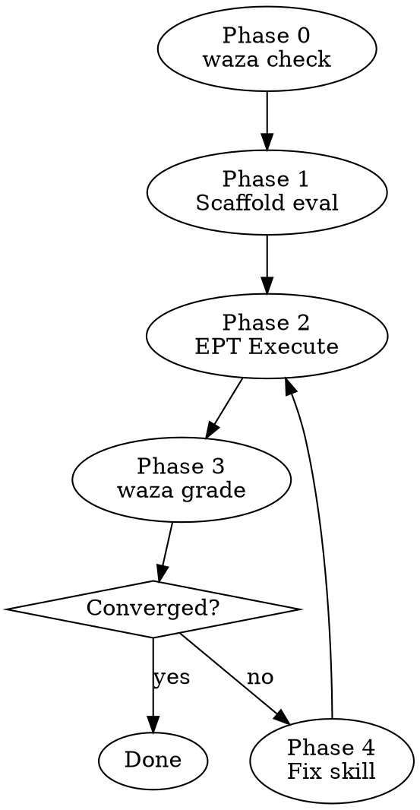

# Skill Forge

Waza (static analysis + graders) + EPT (subagent execution + qualitative discovery) 통합 스킬 개선 루프.

## Prerequisites

- `waza` CLI installed (`which waza`)
- Target skill has SKILL.md
- Waza project initialized in skill directory (`waza init`)

## Pipeline



### Phase 0: Static Analysis

Run without user input:

```bash
waza check skills/<name>
waza tokens count skills/<name>
```

Extract:
- Compliance score (Low/Medium/Medium-High/High)
- Token count vs budget
- Spec violations
- Advisory findings

If no `evals/` directory exists, run `waza init .` first.

### Phase 1: Scaffold or Verify Eval

If eval tasks don't exist:
```bash
waza suggest skills/<name>
```

If eval tasks exist, validate schema:
```bash
waza check skills/<name>  # includes schema validation
```

Ensure eval.yaml uses `executor: mock` (real execution handled by Phase 2).

### Phase 2: EPT Execute

For each task in `evals/<name>/tasks/*.yaml`:

1. Read task `inputs.prompt`
2. Dispatch a fresh subagent via Agent tool with:
   - The skill's SKILL.md content as system context
   - The task prompt as the scenario
   - Task `inputs.files` as fixture context (read from `fixtures/`)
3. Collect subagent response:
   - Output text (the review/action result)
   - `tool_uses` and `duration_ms` from Agent metadata
   - Self-reported unclear points and discretionary fills

Format results as JSON matching Waza's expected structure:
```json
{
  "task_id": "<from task yaml>",
  "output": "<subagent response text>",
  "duration_ms": <from metadata>,
  "tool_calls": <tool_uses count>,
  "status": "completed"
}
```

Save to `results/forge-iter-N.json`.

### Phase 3: Grade Results

```bash
waza grade evals/<name>/eval.yaml --results results/forge-iter-N.json
```

If `waza grade` doesn't accept the format, fall back to manual grading:
- Run text graders: regex match on output
- Run code graders: eval assertions on output
- Report pass/fail per grader per task

Combine with EPT qualitative data:
- Waza scores (objective: pass/fail per grader)
- EPT unclear points (qualitative: what confused the executor)
- EPT discretionary fills (qualitative: what wasn't specified)

### Phase 4: Fix Skill

Apply minimum fixes addressing:
1. **Failed graders** → skill body doesn't teach the right behavior
2. **Unclear points** → skill wording is ambiguous
3. **Discretionary fills** → skill is silent on decisions it should guide
4. **waza check findings** → structural/compliance issues

One theme per iteration. Do not batch unrelated fixes.

### Phase 5: Convergence Check

**Converged** (stop) when 2 consecutive iterations satisfy ALL:
- Waza graders: all tasks pass
- EPT unclear points: 0 new
- waza check: no new violations

**Diverged** (escalate) when 3+ iterations without grader improvement.

**Resource cutoff**: ship at 80+ score if improvement plateaus.

## Presentation Format

```
## Forge Iteration N

### Static (waza check)
- Compliance: {score}
- Tokens: {count}/{budget}
- Violations: {list}

### Execution (EPT)
| Task | Pass | Score | Steps | Duration | Unclear |
|------|------|-------|-------|----------|---------|

### Qualitative
- Unclear: {list}
- Discretionary: {list}

### Fix Applied
- {description}

(Convergence: {N}/2 consecutive clears)
```

## Anti-Patterns

- Do NOT run `waza run` with `copilot-sdk` executor — use EPT subagents instead
- Do NOT reuse subagents across iterations — fresh agent each time
- Do NOT fix multiple unrelated issues per iteration
- Do NOT skip `waza check` even if graders pass — structural issues matter
